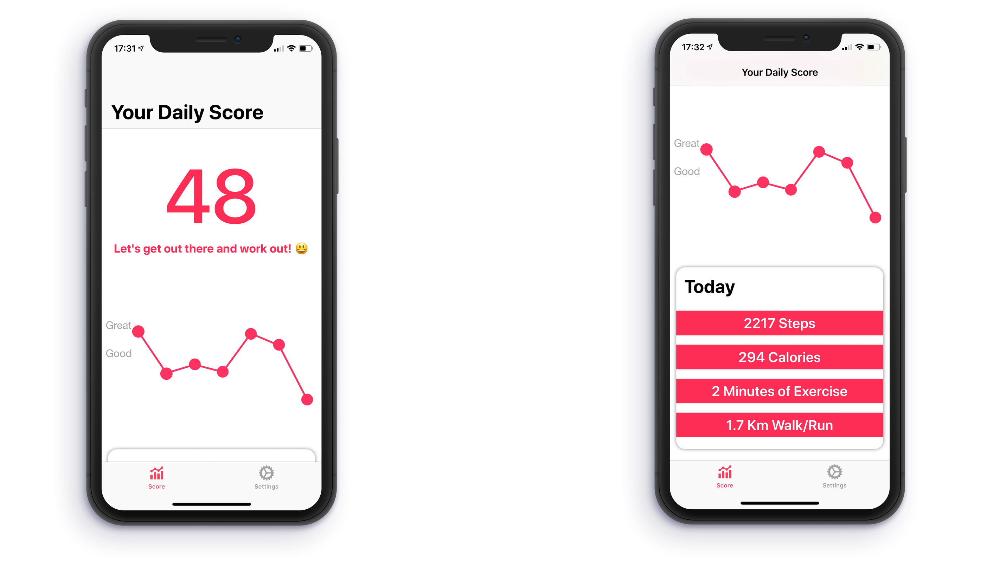

# ActivityScore
> A simple app that show's a number representing how active you are.

This app uses your health data stored on tour device to generate a number between 0 and 250. The more active you are, the higher it will be. Also the app has a basic in app purchase implemented (Not a real purchase) wich allows you to remove ads.



## Setup Google Ads
To correctly set up google ads you need to have an account on Admob.com. Then find this function in ```ScoreViewController.swift``` and replace the placeholders with your ID's
```sh
    func addAd() {
        //Request
        let request = GADRequest()
        request.testDevices = [kGADSimulatorID]
        request.testDevices = [ "YOUR TEST DEVICE ID" ]
        
        //Set up ad
        adBanner.adUnitID = "YOUR ADD UNIT ID"
        
        adBanner.rootViewController = self
        adBanner.delegate = self
        
        adBanner.load(request)
    }
```

## Release History

* 0.2.0
    * ADD: Onboarding Screen
* 0.1.1
    * Health implementation finished
    * Bare bones of inApp purchase implemented
* 0.1.0
    * UI finished!
    * ADD: Started implementing Health API
    * Line Graph implemented
* 0.0.1
    * Development Started

## Meta

Tobias Ruano – [@tobiasruano](https://twitter.com/tobiasruano) – truano@uade.edu.ar

Distributed under the Apache License. See ``LICENSE`` for more information.

[https://github.com/tobiasruano/ActivityScore](https://github.com/tobiasruano/ActivityScore)

## Contributing

1. Fork it (<https://github.com/tobiasruano/ActivityScore/fork>)
2. Create your Feature Branch (```git checkout -b feature/AmazingFeature```)
3. Commit your Changes (```git commit -m 'Add some AmazingFeature```)
4. Push to the Branch (```git push origin feature/AmazingFeature```)
5. Create a new Pull Request
